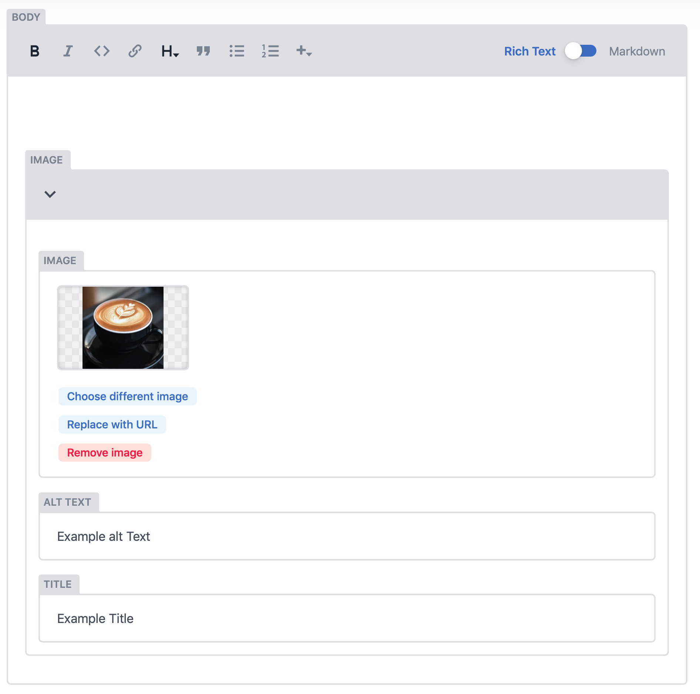

# Adding an Image

Images can be added to the static pages in two ways. 

* **Rich Text Inline Image \( + icon\)**
* **Using Markdown syntax**

Of the two while the inline Editor is more visual, the Markdown Entry allows for much more scrutiny in checking for errors.


## Rich Text Method

To add an image inline, first click the plus icon - "+" at the top of the editor and select image. This will inject an image block within the editor as seen in the image below. Then follow the same process for uploading an image or selecting and existing image from the Media Tab. 



Images can be added with: 

* **Alt Text -** This will imporve the accessibility of your site and make for greater inclusivity.
* **Title -** This will be the refernce in the media assets folder. 

## Using Markdown.

In Markdown the syntax \( or code\) to input an image is the following: 

```text

```

An image is made up of 3 parts. The **exclamation mark**, which denotes this will be an image. The **square brackets \[ \],** which contain any Alt text for accessibility and finally the **curved brackets \( \)** which contain the image URL and an Optional "Title" in quotation marks. 


**Watch your spacing.** There are no spaces between the ! and \[square brackets\] or between the \[square brackets\] and the \(curved brackets\). If the formatting isnt followed correctly, the image will not render.



##  

