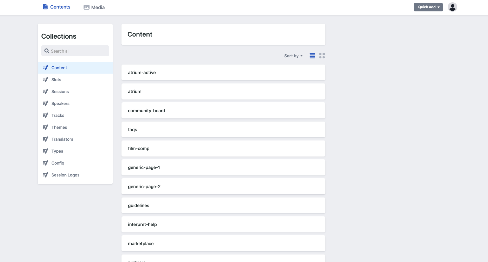
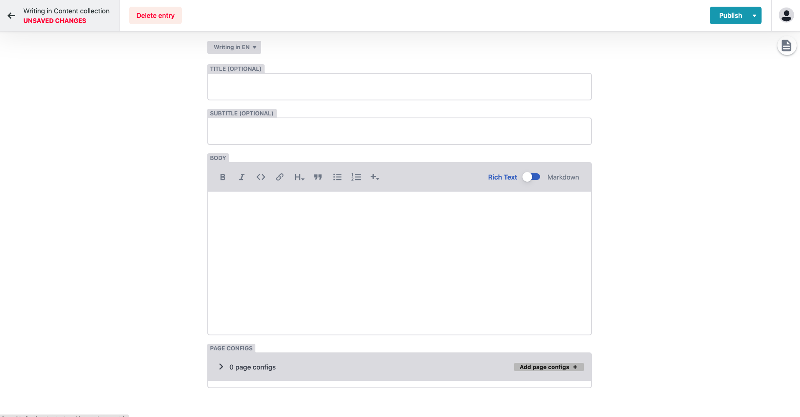

# Copy pages

Copy for pages can be found and edited under the **"Collection - Content".** This lists all the avaible pages for you to edit copy on the Huddle platform. 


If you wish to **add** **or remove** pages from the platform you will need to speak directly with you event coordinator and project manager from Huddle as this much be done in code and deployed to the live servers. 

**Please be aware this will take 1-2 working days for changes to take effect.** 


### **Copy pages consist of 4 main elements**

* **Title -** This will be the main titled listed on a page. \(Optional\)
* **Subtitle -** This will be a subtitle listed at the top of a page. \(optional\)
* **Body Copy -** This is where you will place the content to be displayed on the relevant page with all styles.
* **Page Configs -** These define special functionality or features for an individual page. 

