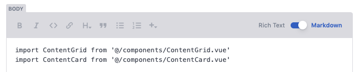
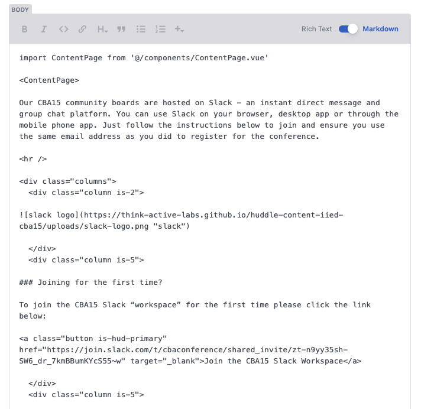

# HTML & Import Scripts

Within the Huddle platform, static pages have the ability to use inline HTML and code imports to style the layout of a static page. Examples of pages that this can be seen on are the Resources and Community Board pages. 


Its important that these pieces of code are **NOT EDITED** **or changed** as this may prevent a page from being viewed in its correct format


## **Example of import scripts**

* Import scripts should be seen at the top of the **pages body input.** 
* Import scripts **MUST** be listed first on the input.
* Import scripts **MUST** have an additonal **line break** between them and content.

## **Example of  inline-HTML**

* When editing HTML take care not to remove any Syntax's such as arrows ,"&gt;" or quotations marks "".
* Ensure `<divs>` are opened and closed correctly.
* Buttons are listed as `<a class="button is-hud-primary"` 

