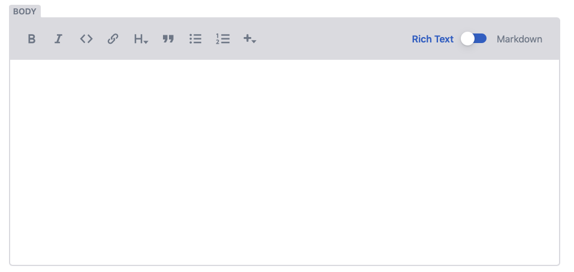
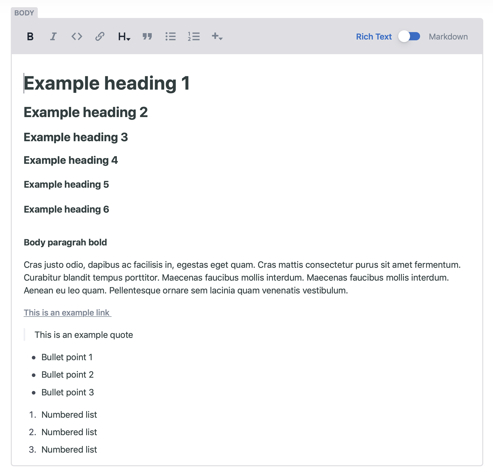

# How to use the Rich Text Editor.

When ever you edit any copy for on the CMS you will be greeted with the following Rich text editor

The rich text editor allows you to make text:

* **Bold** 
* **Italic**
* **Insert Code**
* **Insert links** 
* **Add Heading Styles from 1-6** 
* **Add a quote** 
* **Create bullet point list** 
* **Numbered List**
* **Add image / add codeblock**

### 

