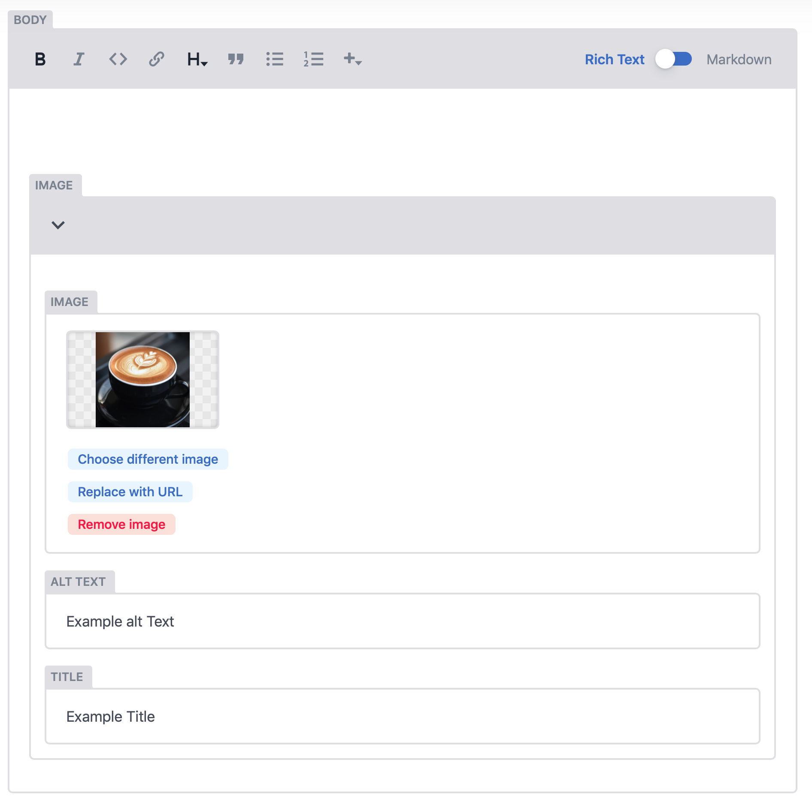

# Rich Text Editor

When ever you edit any copy for on the CMS you will be greeted with the following Rich text editor

The rich text editor allows you to make text:

* **Bold** 
* **Italic**
* **Insert Code**
* **Insert links** 
* **Add Heading Styles from 1-6** 
* **Add a quote** 
* **Create bullet point list** 
* **Numbered List**
* **Add image / add codeblock**

### Adding an Image - inline

To add an image inline, first click the plus icon - "+" at the top of the editor and select image. This will inject an image block within the editor as seen in the image below. Then follow the same process for uploading an image or selecting and existing image from the Media Tab. 

Images can be added with: 

* **Alt Text -** This will imporve the accessibility of your site and make for greater inclusivity.
* **Title -** This will be the refernce in the media assets folder. 

