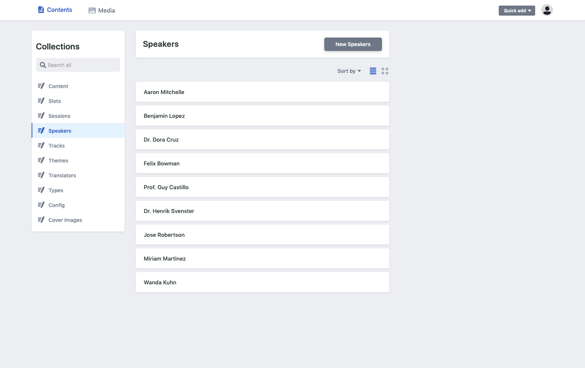
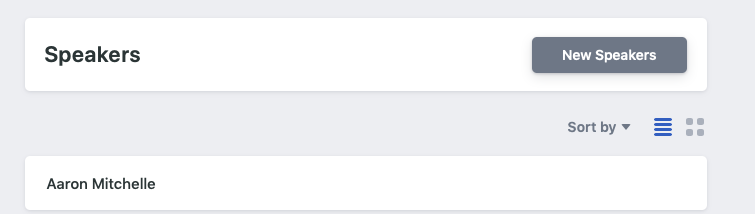
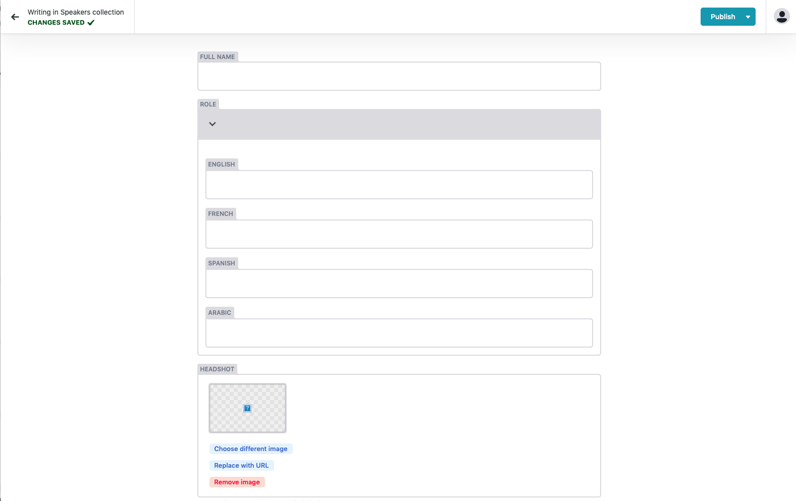

# Adding speakers

During your summit you may have a variety of guests or speakers presenting throughout your schedule. Huddle allows you to spotlight these speakers in both the schedule / agenda but also in the specific session pages. 

&lt;&lt;insert image of the schedule page and session page&gt;&gt;

A speaker profile consists of 4 main elements:

1. **Full name** 
2. **Role** 
3. **Bio** 
4. **Headshot.**

##  Full name

This will be the full name of your speaker.

##  Role 

&lt;insert picture&gt;

This will be the main title that accompanies your speaker in the schedule. This could be something like "CEO, International company" or "Principle developer, Example Tech Ltd".

As will most sections of Huddle, role is multi-language compatible. As a default the platform will automatically have English, French, Spanish and Arabic. If you dont have multiple langugages then dont worry, just leave those fields blank. 

##  Bio

&lt;insert picture&gt;

The bio is an opportunity to ellaborate and tell your attendees a little bit more about your speakers. Whether they invented the next big product or showcase some of there past experiences. You'll probabaly find that people love to spotlight themselves so this section could end up being huge if your not careful. 

Our editor allows you to style your bio in numerous ways with multiple formatting:

* Bold / italics/ underlined. 
* Bullet point / Numbered list.
* Ability to add a link

And for our power users - theres also the ability to edit directly in Markdown language.


As a guide we've found it best to keep these bio's at around the _**500 character count**_. This way your attendees have enough information without switching off. 


As will most sections of Huddle, Bio is multi-language compatible. As a default the platform will automatically have English, French, Spanish and Arabic. If you dont have multiple langugages then dont worry, just leave those fields blank. 

## Headshots

&lt;insert headshot image&gt; 

Arguably the most important part of a speaker profile. Whats better to communicate a friendly and exciting speaker than a headshot. Headshots will appear on the main schedule and also on individual sessions \( on the right hand side\). 

**When uploading an image to Huddle please remember the following rules:** 

#### Square image - JPEG /PNG

Huddle uses square images for its headshot. This is because we apply rounding on the platfrom to automatically make them circular. But secondly because a square image is the best way to frame a speakers head. 

Upload your headshots as either a JPEG or PNG.

**Minimum size - 128 x 128px**

Ensure your picture is no smaller than 128px. Any lower and your image will be pixelated or blurry. **We reccomend 1024 x 1024 px.** This is the perfect sie to have a crisp photo over mobile and web displays including retina. 

**Keep file sizes small  &lt; 3Mb**

Web experiences all depend on receiving content quickly and smoothly. Ensure to keep your file sizes small as this will decrease page loading times and have a general overall performance on your attendee expereince. 

## Adding a speaker in Huddle

#### **Step 1**

On the left hand side of the CMS navigate to "Speakers" under the collections. This page will visualise all speakers as a scrollable list, arranged in alphabetical order.

#### Step 2 

At the top of the page click the '**new speaker'** button**.** This will create a blank speaker profile page where you are able to enter yoru speakers information. Here you can add their name / role / bio and headshot. 

When adding a 

**Step 3** 




On the left hand side of the CMS navigate to "Speakers" under the collections. This page will visualise all speakers as a scrollable list, arranged in alphabetical order.




At the top of the page click the '**new speaker'** button**.** This will create a blank speaker profile page where you are able to enter yoru speakers information. Here you can add their name / role / bio and headshot. 

Adding a headshot can be done through two methods:

* **"Choose an image" -** This opens a modal of all the images on Huddle. From here you can upload your selected image. 
* **"Insert from URL" -** If your already hosting the image online and have been given a link, you can quikcly and easily link to your image using a URL. Just paste the URL into the modal and click "OK"







\*\*\*\*

## Deleting a speaker in Huddle

