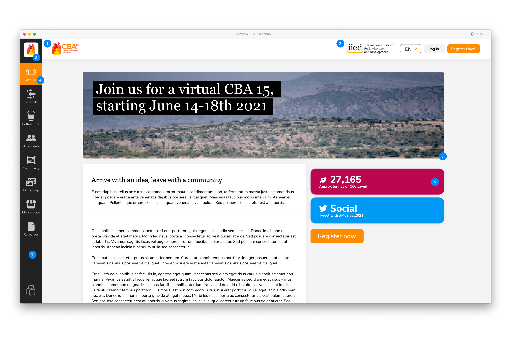
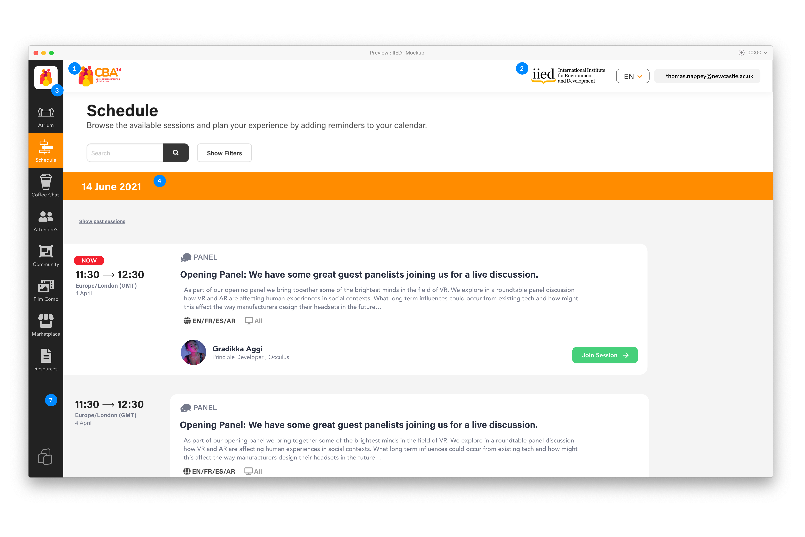
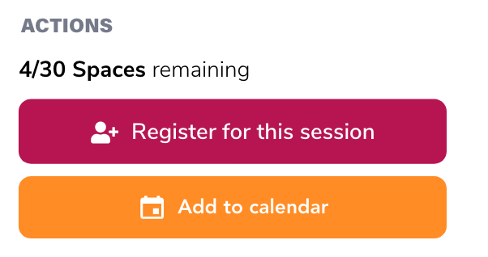

# Huddle Platform Branding

## Branding Checklist

The Huddle platform allows you to customise your event to match the design of your brand to host a successful event. Elements such as logos, colours palettes, banners and icons can all be adjusted to improve the overall aesthetic.

The following elements on the Huddle Platform can customised \(see image for location\) :

1. Event logo 
2. Organisation logo 
3. Sidebar Icon & Favicon
4. Primary Accent Colour
5. Atrium Banner
6. Secondary Accent colour
7. Sidebar Colour

## 1 - Event Logo

This is the main branding for your event. This should be provided in a vector format for scaling on multiple device sizes.


**File Type:**

**.SVG / .AI / .EPS** \( File size not important\)


## 2 - Organisation Logo

This is the organisation branding that will accompany your Event Logo. This should be provided in a vector format for scaling on multiple device sizes.


**File Type:**

**.SVG / .AI / .EPS** \( File size not important\)


## 3 - Event Icon & Favicon

The Event icon fits in at the top of the Sidebar navigation on the left hand side of the Huddle UI. The event icon is made for a simplified symbolmark of your full event logo. It ensures your branding can be seen on any page of the Huddle platform. You should minimise use of any text as this may not be legiable on smaller screen sizes. 


**Event icon:**

Size: 60 x 60px

Filetype:  **.SVG / .AI / .EPS** \( File size not important\)


This event icon will also be used as your events **Favicon.**  
  
A **favicon** is a small 16×16 pixel icon that serves as branding for your website. Its main purpose is to help visitors locate your page easier when they have multiple tabs open. Due to their tiny size, favicons work best as simple images or one-to-three characters of text. Favicons are not to be confused with logos but are sometimes the same. Due to its small size and resolution, the favicon may need to be an even smaller sizer or part of a company’s original logo. 


**Favicon:**

Size: 16 x 16px or 32x32px for Retina screens. 

Filetype:  **.JPEG / .PNG** 


## 4 - Primary Accent Colour

Throughout the Huddle platform we use accent colours to highlight key elements of teh deisgn and layout for your conference. You can customise these colours to you organisation/ event branding to help maintain a consistant brand image and increased profesionalism. 

#### Primary Accent Colour

The primary accent colour is the main colour we use on the Huddle Platform. The will be used on the sidebar navigation elements to highlight which area you have selected and will also appear as the main colour bar across the Schedule page as can be seen in the image below. Please submit this as a **HEX value** to ensure correct hue is chosen.


**Colour HEX Value:**

For Example: \#FF8c25


## 5 - Atrium banner

The Atrium banner is a perfect way to style the first page attendees will land on after registration. It can be used to highlight the Event's branding, showcase imagery or highlight particular sessions happening at your event. 


**Banner Requirements:**

Size: 1344px x 314px

Filetype:  **.PNG / .JPEG** 

\( Please ensure image is under 3MB. Larger files will affect loading times.\)


## **6** - Secondary Accent Colour

The secondary accent colour is used in conjunction with the primary accent colour on the Huddle Platform. It will be used when multiple interactions are required by attendees to differentiate between options. An example of this is on the session page when a attendee can register for a session and also download a Calendar.ics. This can be seen below: 

Please submit this as a **HEX value** to ensure correct hue is chosen.


**Colour HEX Value:**

For Example: \#FF8c25


## 7 - Sidebar Colour 

The sidebar is the core navigation element of the Huddle Platform. It allow attendees to access and easily navigate to any key area of the Huddle Platform. You are able to edit this colour value to match your branding.   
  
You **SHOULD:** 

* Consider your primary accent colour contrasts well against your sidebar colour. Failure to do so will affect the accessibility of Huddle and users may not have clear navigation on the site. 

Please submit this as a **HEX value** to ensure correct hue is chosen.


**Colour HEX Value:**

For Example: \#FF8c25


