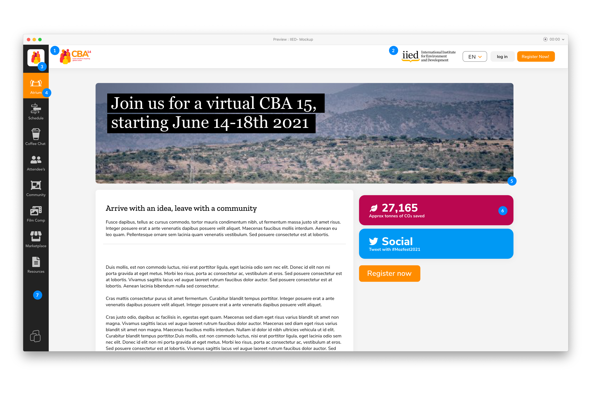

# Huddle Platform Branding

## Branding Checklist

The Huddle platform allows you to customise your event to match the design of your brand to host a successful event. Elements such as logos, colours palettes, banners and icons can all be adjusted to improve the overall aesthetic.

The following elements on the Huddle Platform can customised \(see image for location\) :

1. Event logo 
2. Organisation logo 
3. Sidebar Icon & Favicon
4. Primary Accent Colour
5. Atrium Banner
6. Secondary Accent colour
7. Sidebar Colour

