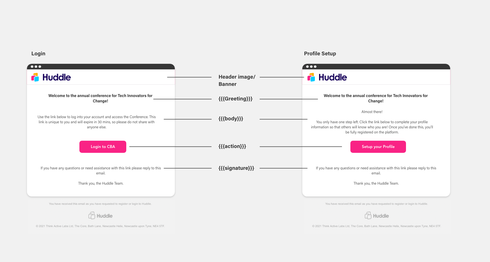

# Onboarding Emails

Huddle **doesn't store any passwords.** Instead we use "Magiclinks" which are a form of passwordless login.

Instead of the user entering any login credentials to sign in, they are sent a URL with an embedded token via email. Once the user clicks that link to authenticate, they are redirected back to the platform having successfully signed in—as if they used a “magic” password, but without the actual password.

**As part of your Huddle license you can customise this automatic emails.**

#### How do magic links work? 

Magic login involves three steps:

1. The user enters their email address at Huddles login screen.
2. If it’s a registered email address, the user will receive an email with a magic link. For security, these magic links only last **30 mins** before needing to be regenerated.
3. The user opens the email and clicks the magic link to complete the sign-in process.

#### Huddle Email Template 

The onboarding emails consist of 5 core elements.

1. **Banner Logo or Image** - This will be the same for both the Login email and Registration email.
2. **Greeting -** This is an opening piece of text to welcome your attendees to your event. It should be short and simple such as a welcome.
3. **Body -** This is the main accompanying text. It should explain what the attendee should have to do and in what time frame \(if any\). Again keep this short as the main function of these emails is to click the link button below.
4. **Button link -** This is your magic link to the platform. The text should be short and direct to show users exactly what to do e.g. "Click here to Login" or "Setup for Profile"
5. **Signature text** - This is any text which you may want to use to sign off at the end of the email. You could also add any additional event information here.

Additonally to this you may want to add images or extra text your the email. This is completely possible but remember that this information will display on both emails. This is because Huddle uses a dynamic template \( one template that can be rendered with multiple bits of text\). Should you want to do this, please speak with your account manager at Huddle.

#### Features : 

* Edit and **customise your emails** with your own text, colors, content and links
* **Content management:** add images, links and to your email template to match them to your event's visual identity.

