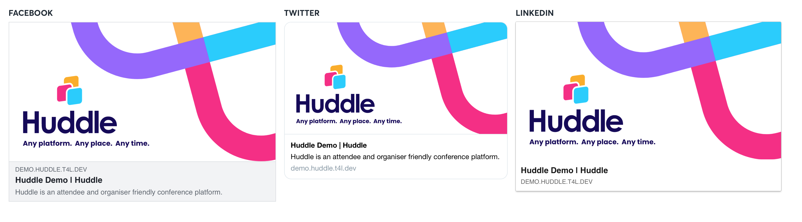

# OpenGraph Share images

## **What is an opengraph image?**

[Open Graph](https://ogp.me/) is an internet protocol that was originally created by [Facebook](http://fbdevwiki.com/wiki/Open_Graph_protocol)to standardize the use of metadata within a webpage to represent the content of a page.

Within it, you can provide details as simple as the title of a page, or a description or an eye grabbing image to grab the attention of your viewers. These pieces all fit together to form a representation of each individual page of the internet. ****You'll most likely have seen them before on twitter and facebook and they look like the examples seen below. 

## **Why do i need it?**

Content on the internet is typically created with at least one goal in mind -- to share it with others. This might not necessarily matter if you’re just sending it to one friend, but if you want to share it or want it to be shared on any social network or app that utilizes rich previews, you’ll want that preview to be as effective as possible.

##  **Core elements of an Opengraph.** 

While it should be pretty straightforward, here’s a breakdown of what each of the tags mean:

* `og:image`: This should be a link to an image that you’d like to represent your content. It should be a high resolution image that the social networks will use in their feeds using the following sizes.
  * For twitter: **1024 x 512px**  
  * For Facebook: **1200 x 630px** 
* `og:title`: **\(up to 60 characters\)** The title of your page or event.
* `og:description`: **\(up to 160 characters\)** A description of your page or event.
* `og:url`: This will be the URL of the current page.


Please provide these assets to your **Huddle Project Manager**  in order to have your custom Opengraph images for your event. 


