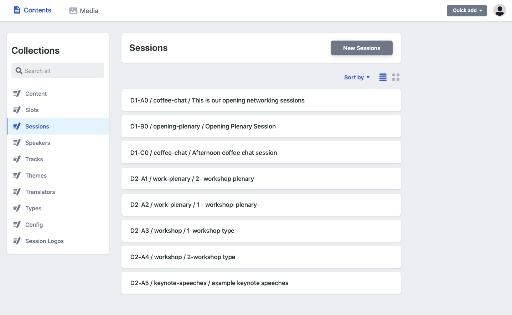

# Netlify - Understanding the UI.

Netlify is the core Content management system \(CMS\) being used by Huddle. 

### The CMS is made up of two main areas: 

* **Contents -** Contents are made up of a series of **Collections**, which are grouped pieces of data about your event. For example your events speakers would all be grouped into a "Speakers" collection. 
* **Media -** Your like other content management systems, you can upload assets and images to this area to be used accross the platform. 

You can access these two areas by clicking on the navigation bar located at the top of the CMS

### Contents &gt; Collections 

Collections are located on the left hand side of the User Interface in the CMS. To navigate between collections, click on one of the elements and the body content on the right hand side will change.. 

### Media &gt; assets

Similar to other websites like wordpress or drupal, Huddle stores all of its media in an assets folder that can be loacted from the navigation in the header. 

Clicking on this tab will open a modal that allows you:

* **Upload new assets**
* **Download assets**
* **Search** 
* **Copy the image path.** 
* **Delete assets.** 


Copying an images path is used when inserting images inline to a static page 

**Example Copy path:**

'uploads/benjamin-lopez-thumb.jpg'

You would then past this reference into the image tag in the rich text editor. 


