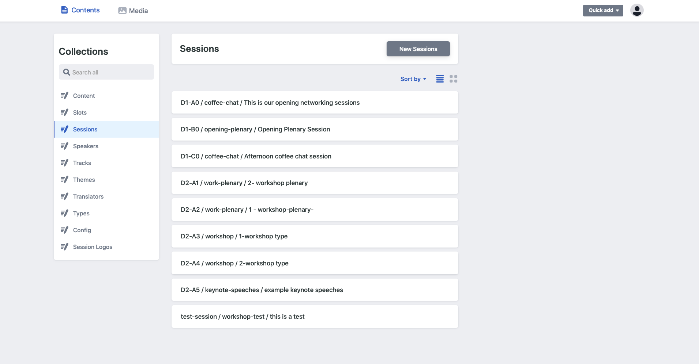
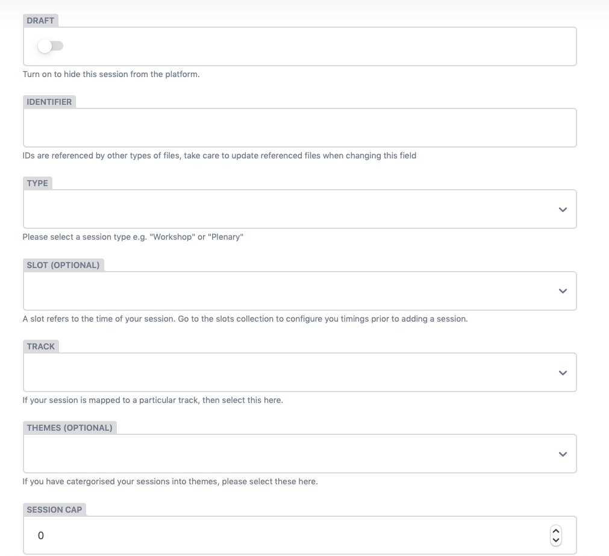
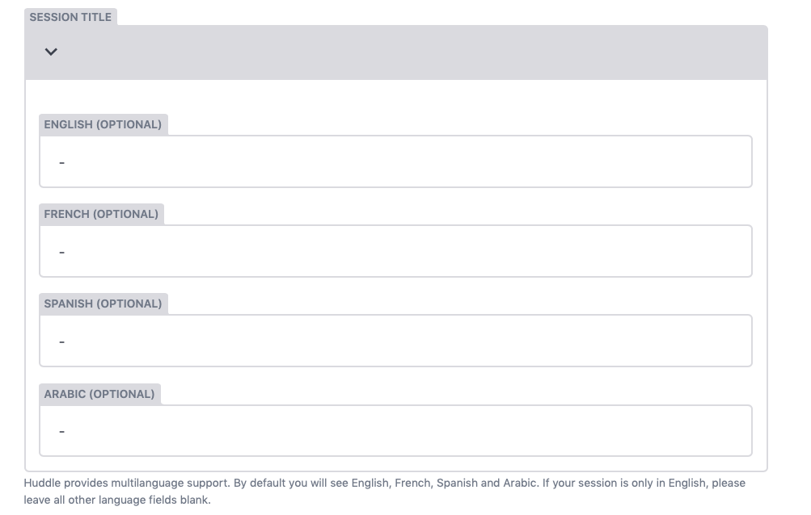
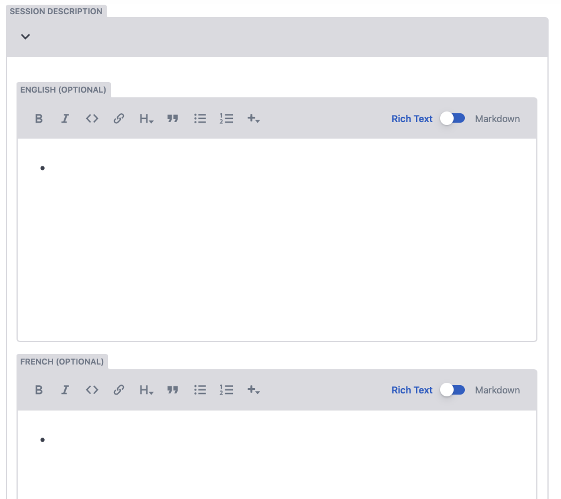
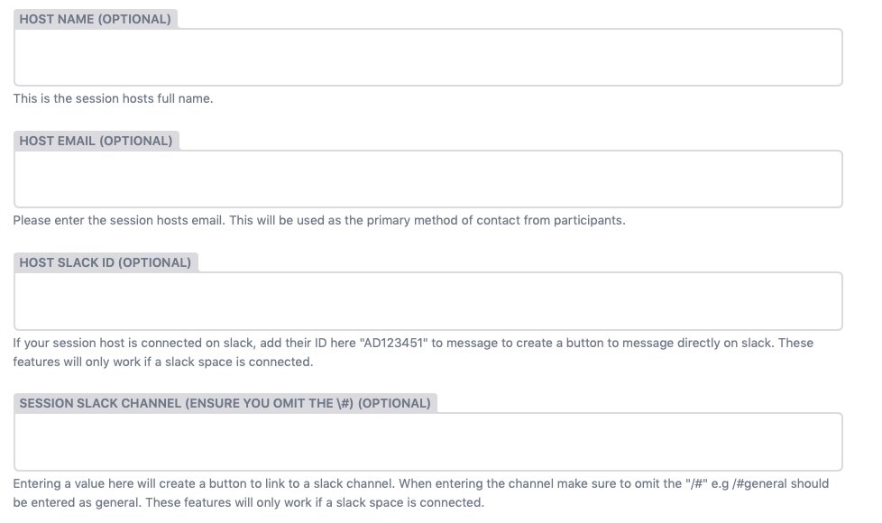
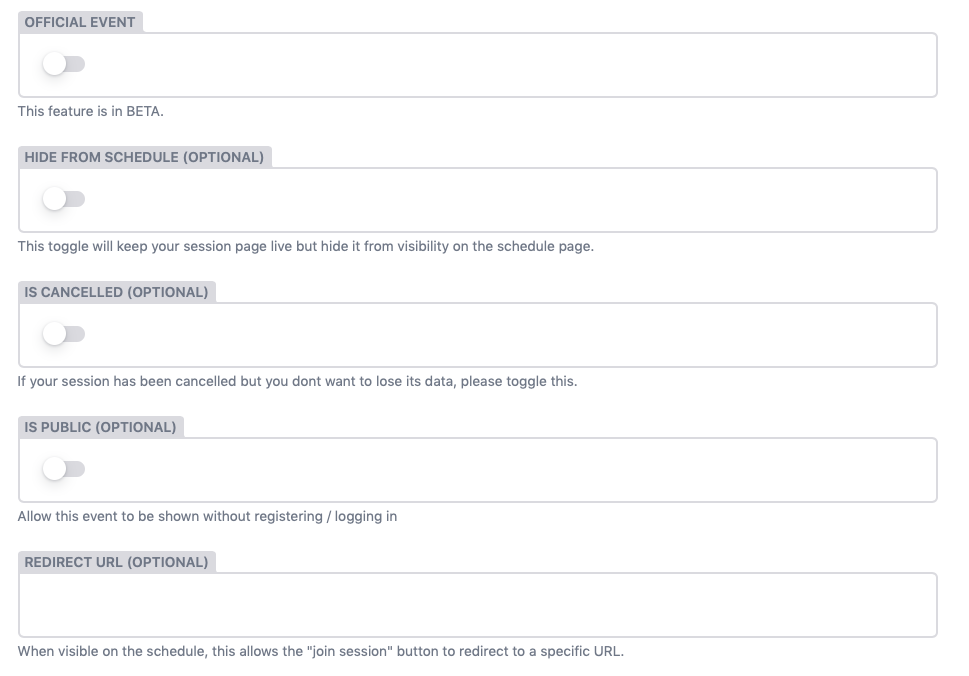

# Sessions

 To view you sessions go to "Contents" and navigate to the Session Collection on the left hand side. You will be shown all of your sessions in a list format with the following naming convention:


**SESSION ID / SESSION TYPE / SESSION TITLE**


If you want to view this as a grid, you can click on the small 4 squares icon located next to the sorting functionailty. 

**Sorting**  
You can sort your sessions by:

* **The date updated** \(ascending - descending\)
* **Identifier** \(ascending - descending\)
* **Author** \(ascending - descending\)

The folowwing elements can be altered on a session. 

> ## Session Setup
>
> * **Type** 
> * **Slot** 
> * **Track** 
> * **Themes**
> * **Session Capacity limit**
> * **Session link opening time**
> * **Session linkes closing time**
> * **Featured event toggle**
> * **Toggle - Draft** 
> * **Attendee interaction dropdown**
> * **Attendee device suitability dropdown**

> ## Session **Content**
>
> * **Title \(Multi-language\)** 
> * **Description \(Multi-language\)**
> * **Language**
> * **Speakers**
> * **Session Links**
> * **Session Logo**

> ## Host Information
>
> * **Host Name**
> * **Host Email** 
> * **Host Slack ID -** 
> * **Session Slack ID**
> * **Host Organisation \(Multi-language\)**

> ## Optional Configuration
>
> * **Toggle - Offical Event** 
> * **Toggle - Hide from Schedule**
> * **Toggle - Cancelled**
> * **Toggle - Make public**
> * **Redirect URL**

\*\*\*\*

