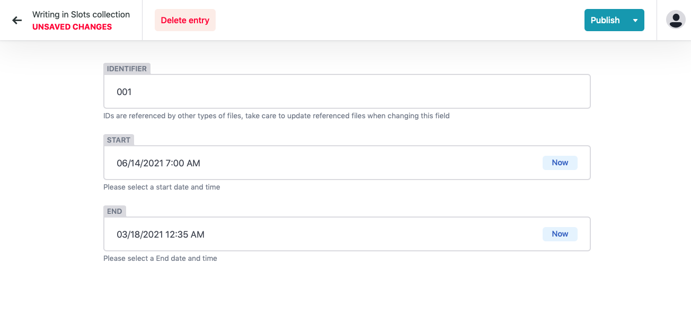

# Slots

Before adding content to Huddle you'll most likely be creating a simple schedule. This may include blocked out times for sessions and periods in the day where you may want to network or take a break. 

### **What are slots?**

Slots are a concept that huddle uses to define your sessions 'timeslots' \(hence the name\).

Rather than giving each of your sessions a defined start and end time, we instead assign a start and end to each slot. A slot is then in turn assigned against a session/ series of sessions. 

A slot contains the following information: 

* **Unique ID -** This is only ever seen in the CMS and not on the front end of the platform. This allows you to create custom names for specific time chunks. 
* **Start Date & Time -** The start date & time of your session.
* **End Date & Time -**  The end date and timeof your session. 

### **Why do we use them?**

Slots are used because in the likely event you need to alter your conference or event schedule, you wont have to go into all your sessions individually and update the start and end dates and times. Instead all you need to do is go into the slot that you need to change and update the time here instead. 


**This makes shuffling around your sessions and schedule super easy!** 


