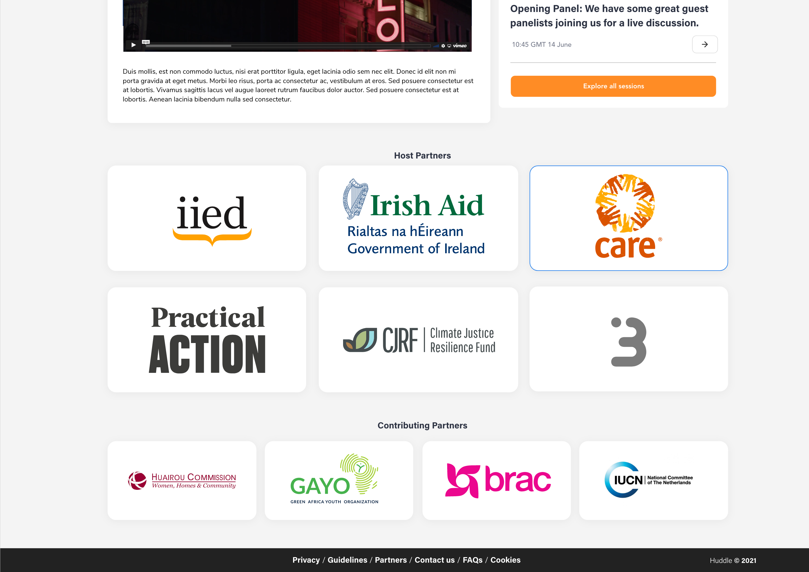
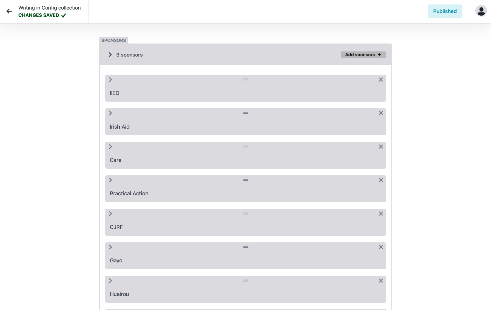
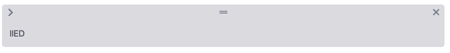

# Sponsors

Huddle allows you to upload logos of sponsors that can be visible in the main atrium area of the conference. Sponsors will be displayed in a a grid layout and can consist of 3 levels of heirachy. 

### Adding sponsor logos

To add new sponsors logos go to the **"Config"** collection on the main CMS content area and select sponsors. 

Example sponsors will be grouped in a sponsor window like seen below. 

The sponsors group indicates the total number of sponsor logos attached to an event and a list view of your sponsors by there name.  If you wish to see all the information about each indiviudal  Click on the Chevron "&gt;" located next to the total value and this will expand the full window. 

### A sponsor contains the following information: 

* **Name -** Please insert the name of your sponsor or organisation. 
* **Logo image  -** Here you will upload your desired sponsor logo or select from the existing assets stored in the Media folder.
* **Sponsor Tier -**  Huddle currently support 3 tiers of sponsor logos. E.g 'Gold, Silver & Bronze" with level 1 being the highest tier. 

### Ordering your sponsors logo


The sponsor logos are rendered on the platform in **list order** from top to bottom. 


To rearrange your sponsors simply click on the **"="** sign in the centre of a sponsor and drag its position either up or down in the list. This is easiest to do when all sponsors are collapsed. 

