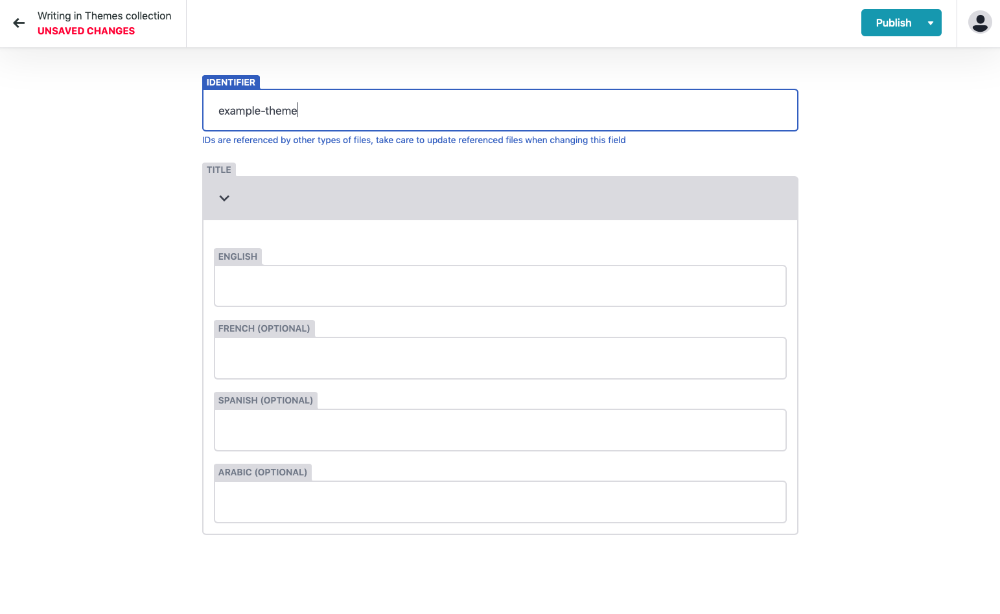

# Themes

Similar to "tracks", for larger events and conferences its likely that you'll want to add themes to particular sessions. This will help differntiate sessions in your schedule and allow users to see what particular space your sessions fit into. 

### **Creating Themes**

Themes consist of two compents:

* **Unique ID -** This is only ever seen in the CMS and not on the front end of the platform. This will be the identifier that you attach to a theme. 
* **Title \(Multi-language support\) -** This is the name of the theme and will be visible on the front end of the Huddle Platform. Should you only be using one language for your event, simply leave the forms blank for any additional languages.

Once you have added a new theme simply click publish **in the top right hand corner** to save your changes. 


## **Publish &gt; Publish now**


\*\*\*\*

