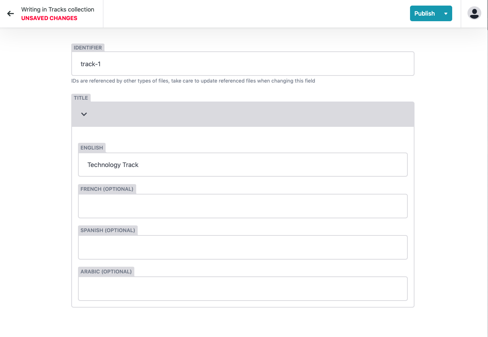

# Tracks

For larger events and conferences its likely that you'll want to split up your sessions into different tracks. This will help direct your attendees down session pathways that may all fall around a particular interest or series of topics. 

### **Creating Tracks**

Tracks consist of two compents:

* **Identifier -** This is only ever seen in the CMS and not on the front end of the platform. This will be the identifier that you attach to a session. 
* **Title \(Multi-language support\) -** This is the name of the track and will be visible on the front end of the Huddle Platform. Should you only be using one language for your event, simply leave the forms blank for any additional languages.

Once you have added a new track simply click publish **in the top right hand corner** to save your changes. 


## **Publish &gt; Publish now**


\*\*\*\*

