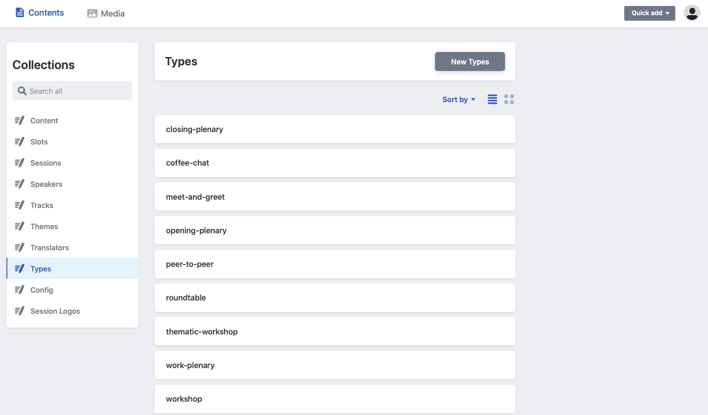
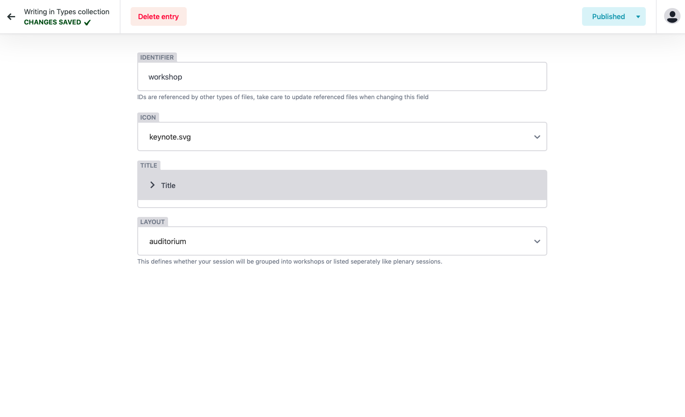
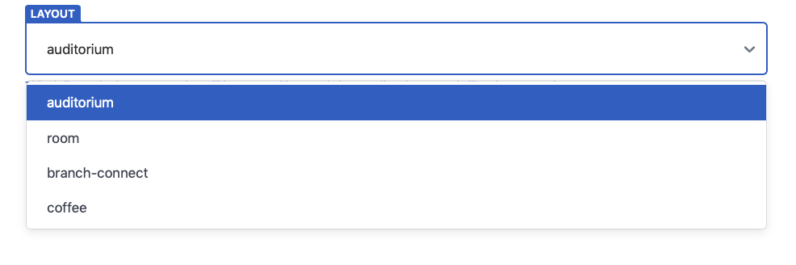

# Types

In order to define differences bewteen sessions, Huddle uses 'types.' Types allow you create create different sessions such as a "workshop" or a "keynote speech" and will indicate this type on a session in the schedule view.

### A type consists of 4 main pieces of information:

* **Unique ID -** This is only ever seen in the CMS and not on the front end of the platform. This will be the identifier that you attach to a type.
* **Icon -**  As well as displaying the type of a session, Huddle allows you to select from a precongifured list of icons. This creates a quick and visual way to differentiate between sessions in the schedule view. 
* **Title \(Multi-language support\) -** This is the name of the track and will be visible on the front end of the Huddle Platform. Should you only be using one language for your event, simply leave the forms blank for any additional languages.
* **Layout -** This defines how your session will look in the schedule and whether or not it will be able to embed a livestream video.

 

**Which layout should i chose?**

I order to determine which layout to choose, you should first ask yourself what is the configuration of that session and where would that session happen if it were to happen at a physical event.  Is it; 

* **"One - Many" \(**broadcast\) - This would include typical plenary sessions where a speaker broadcasts to an audience of many. If you intend on embedding a livestream to attendees and do not require participants to join the zoom room, you should select **"auditorium."**
* **"Many - Many"** \(interactive\) - This would include typical workshop style environments of much smaller groups sizes between 10-50 people. These people may be engaging in conversations and activites that would typically take place in a smaller room. If so, select **"room"**

