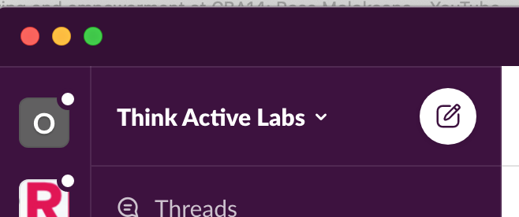
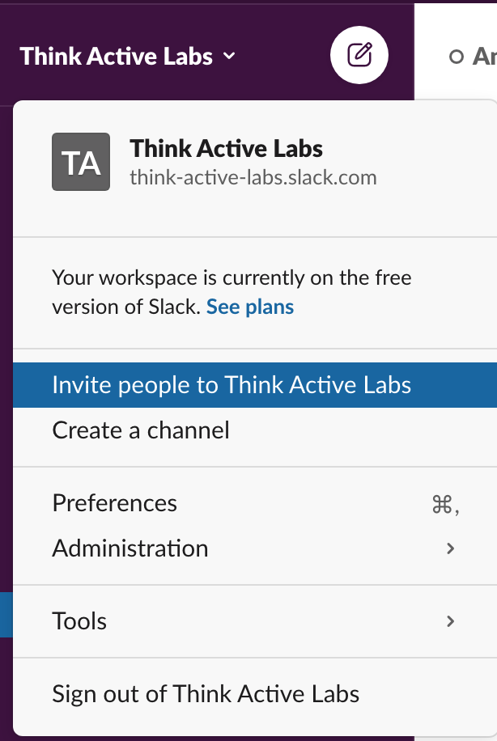
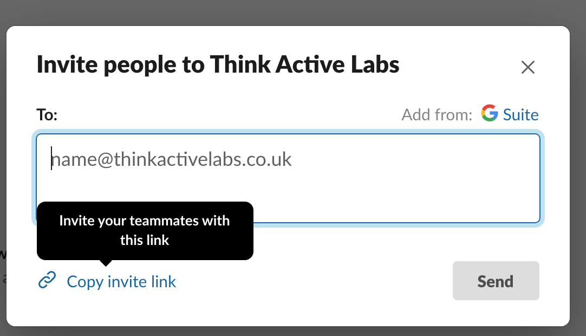
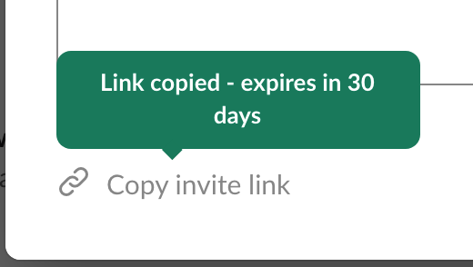

# Slack \( Free Tier\) - invitations

### Using Slack \(free tier\) 

There are a few things you should note when using the **free tier** of slack for your event integration. Where as the **Paid tiers** offer a persistant join the workspace link to add new members. 


The free tiers invitation link expires after 30 days.


 You can create a new one as the owner of the workspace using the following steps. 

1. In the slack app as the **"Owner of the Workspace",** click on the workspace info dropdown in the top left of the application. 

2. Navigate to the **"Invite people to...WORKSPACE NAME"** option. 

3. ****A modal will appear asking to input emails. **Instead** click on the **"Copy invite link"** text. 

4. You will now see a green pop-up stating that this new link will last for 30 days. Take this link and paste into the '_**button URL='**_ in the Community board page in the CMS. 


You will need to do this every 30 days as stated with the slack free tier so set a reminder in your calendar to help!


