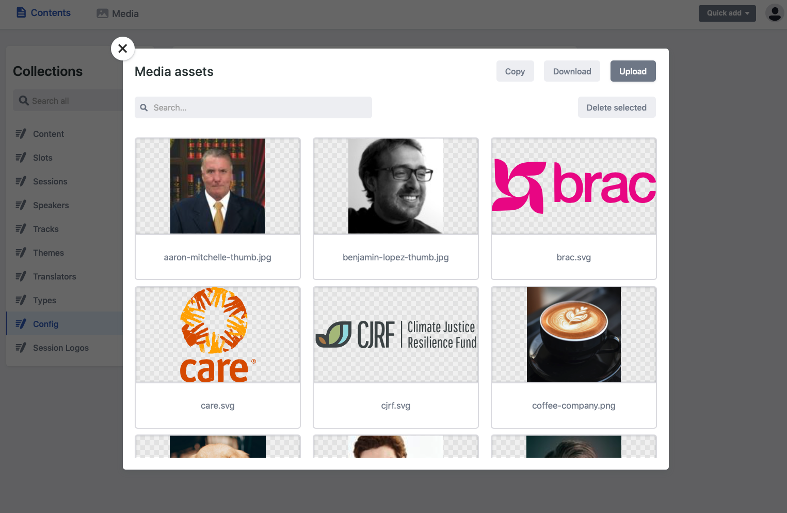

# Uploading media to the CMS

## Assets Modal

Similar to other websites like wordpress or drupal, Huddle stores all of its media in an assets folder that can be loacted from the navigation in the header. 

Clicking on this tab will open a modal that allows you:

* **Upload new assets**
* **Download assets**
* **Search** 
* **Copy the image path.** 
* **Delete assets.** 


Copying an images path is used when inserting images inline to a static page 

**Example Copy path:**

'uploads/benjamin-lopez-thumb.jpg'

You would then past this reference into the image tag in the rich text editor. 


## File types

The media assets allows the upload of the following filetypes:

* JPEG / JPG
* PNG
* SVG
* PDF

## Naming Conventions

Naming conventions are a super useful way to keep track of your media assets and enable you to find content quickly and easily within the Media window.

**The table below suggests some simple naming conventions for assets**

| **Type of asset** | Example name |
| :--- | :--- |
| Speaker Profile image | speaker-full-name.jpg |
| Logo Sponsor image | sponsor-companyname.jpg |
| Session logo image | session-logo-companyname.jpg |
| Icon  | icon-iconname.svg |

